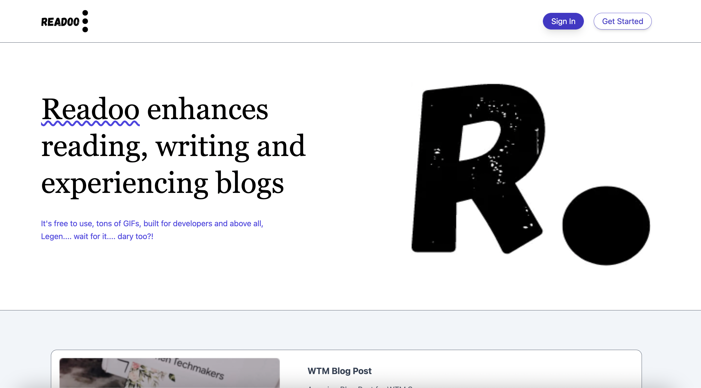
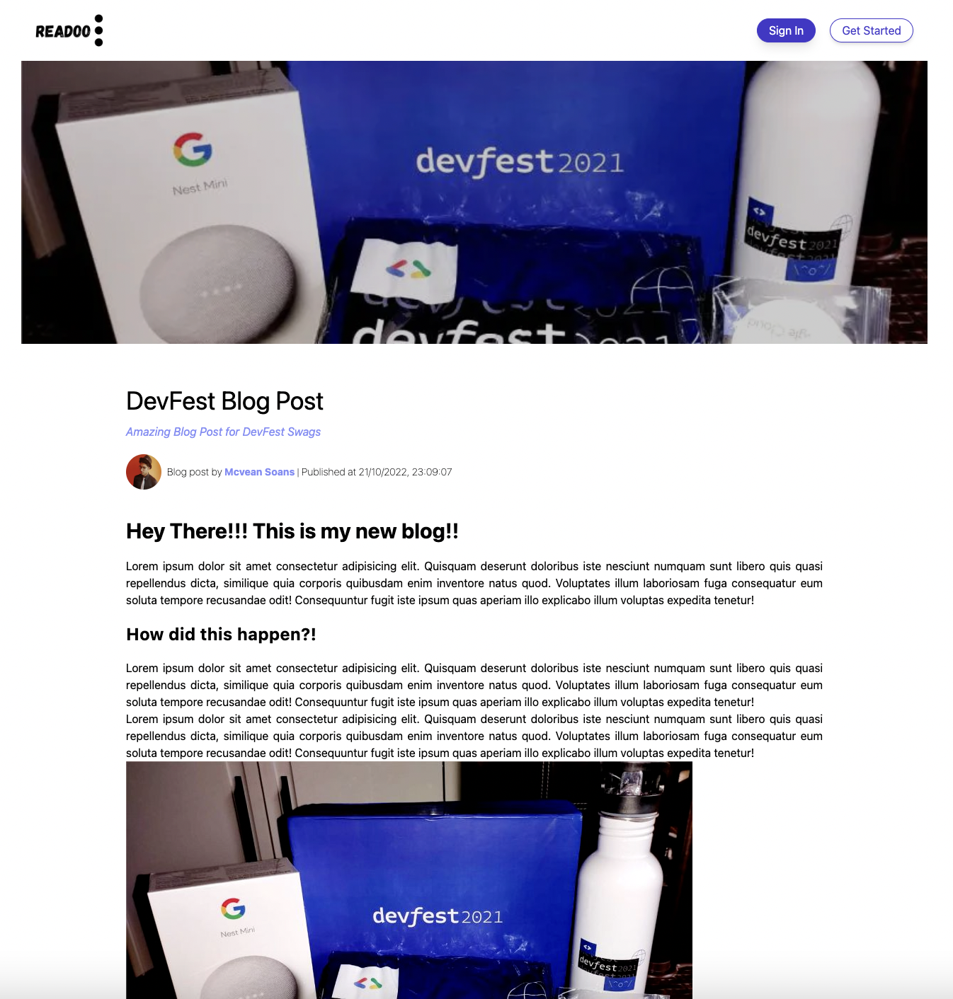
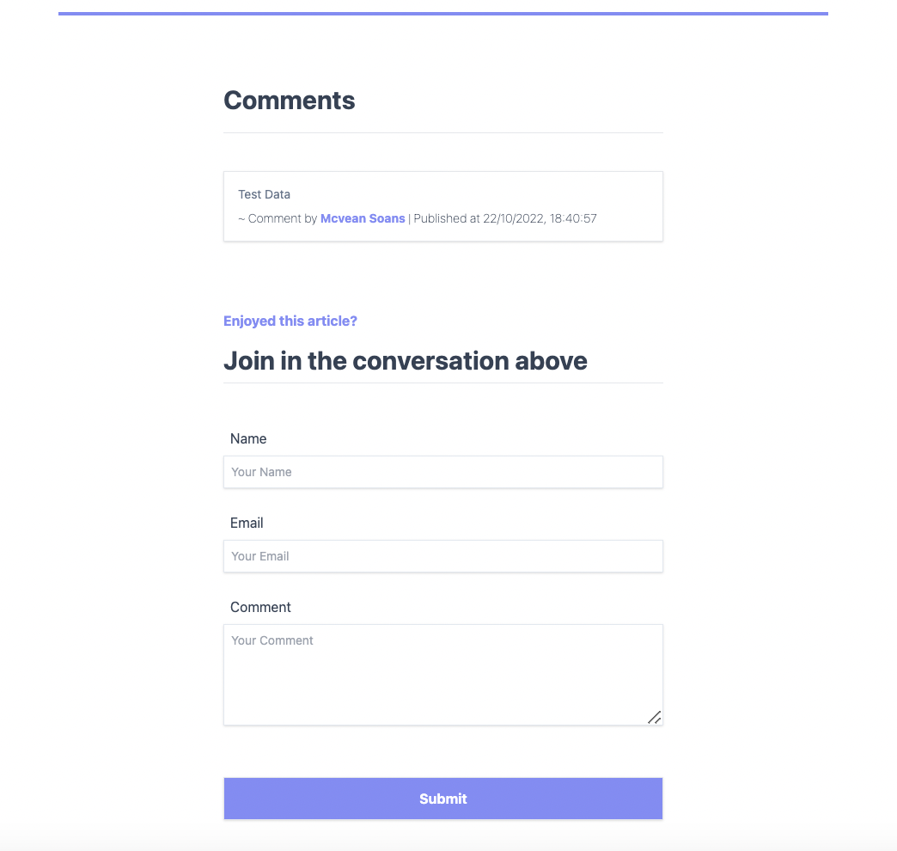

<h1 align="center">
  Readoo
</h1>

  
  
  

> A modern, minimalistic, type-safe web application developed by **McTechie** 👨‍🎨✨

## Concepts Covered

- [x] TypeScript
  - [x] NextJS
    - [x] Prop Types
    - [x] Custom Type Definitions
    - [x] Incremental Static Regeneration (ISR)
  - [x] React Hook Form
    - [x] Form State
    - [x] Form Validation
- [x] Sanity CMS
  - [x] Studio
  - [x] Plugins
  - [x] Mutations
  - [x] Deployment

---

## Preview

### Landing Screen

---

### Blog Page

---

### Comments Section

---
